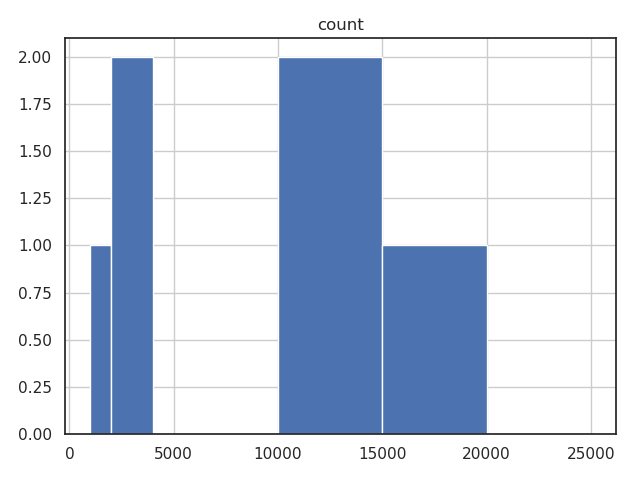
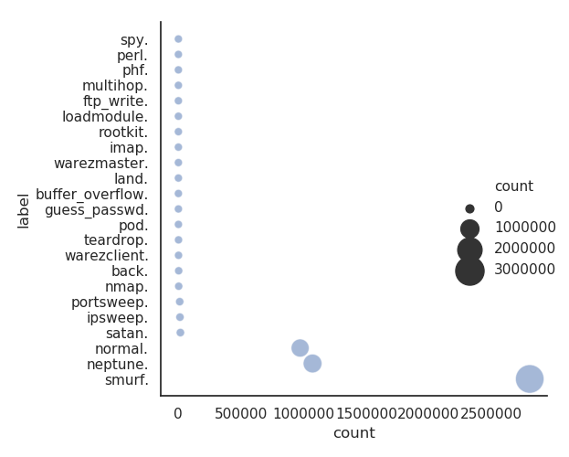
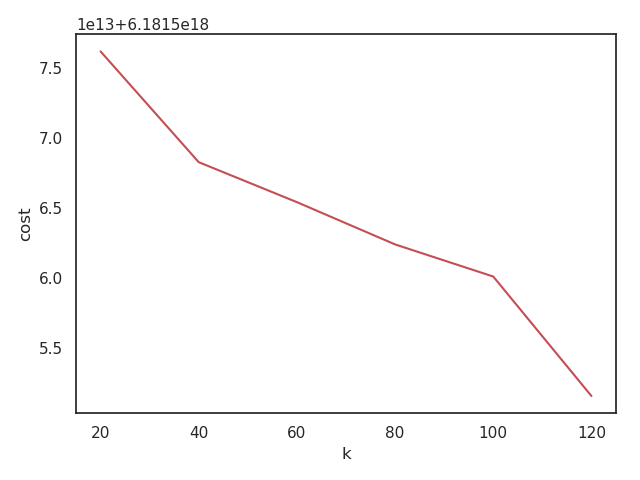

# Network Anomaly Detection using Spark

In this project we are going to detect the anomaly in network trafic using the mllib k means spark.
The inherent problem of anomaly detection is, as its name implies, that of finding unusual things.

Anomaly detection is often used to find fraud, detect network attacks, or discover problems in servers or other sensor-equipped machinery. In these cases, it’s important to be able to find new types of anomalies that have never been seen before—new forms of fraud, intrusions, and failure modes for servers.

Unsupervised learning techniques are useful in these cases because they can learn what input data normally looks like, and therefore detect when new data is unlike past data. Such new data is not necessarily attacks or fraud; it is simply unusual, and therefore, worth further investigation.

## Selecting Algorithm :
#### K-means Clustering:
Clustering is the best-known type of unsupervised learning. Clustering algorithms try
to find natural groupings in data. Data points that are like one another but unlike
others are likely to represent a meaningful grouping, so clustering algorithms try to
put such data into the same cluster.

Some exploit behaviors follow known patterns. For example, accessing every port on a machine in rapid succession is not something any normal software program should ever need to do. However, it is a typical first step for an attacker looking for services running on the computer that may be exploitable.

## Dataset [DL](http://kdd.ics.uci.edu/databases/kddcup99/kddcup99.html)

<table border="1">
<tr><th>+--------+-------------+-------+----+---------+---------+----+--------------+------+---+-----------------+---------+---------------+----------+------------+--------+------------------+----------+----------------+-----------------+-------------+--------------+-----+---------+-----------+---------------+-----------+---------------+-------------+-------------+------------------+--------------+------------------+----------------------+----------------------+---------------------------+---------------------------+--------------------+------------------------+--------------------+------------------------+-------+</th></tr>
<tr><td>|duration|protocol_type|service|flag|src_bytes|dst_bytes|land|wrong_fragment|urgent|hot|num_failed_logins|logged_in|num_compromised|root_shell|su_attempted|num_root|num_file_creations|num_shells|num_access_files|num_outbound_cmds|is_host_login|is_guest_login|count|srv_count|serror_rate|srv_serror_rate|rerror_rate|srv_rerror_rate|same_srv_rate|diff_srv_rate|srv_diff_host_rate|dst_host_count|dst_host_srv_count|dst_host_same_srv_rate|dst_host_diff_srv_rate|dst_host_same_src_port_rate|dst_host_srv_diff_host_rate|dst_host_serror_rate|dst_host_srv_serror_rate|dst_host_rerror_rate|dst_host_srv_rerror_rate|  label|</td></tr>
<tr><td>+--------+-------------+-------+----+---------+---------+----+--------------+------+---+-----------------+---------+---------------+----------+------------+--------+------------------+----------+----------------+-----------------+-------------+--------------+-----+---------+-----------+---------------+-----------+---------------+-------------+-------------+------------------+--------------+------------------+----------------------+----------------------+---------------------------+---------------------------+--------------------+------------------------+--------------------+------------------------+-------+</td></tr>
<tr><td>|       0|          tcp|   http|  SF|      215|    45076|   0|             0|     0|  0|                0|        1|              0|         0|           0|       0|                 0|         0|               0|                0|            0|             0|    1|        1|        0.0|            0.0|        0.0|            0.0|          1.0|          0.0|               0.0|             0|                 0|                   0.0|                   0.0|                        0.0|                        0.0|                 0.0|                     0.0|                 0.0|                     0.0|normal.|</td></tr>
<tr><td>|       0|          tcp|   http|  SF|      162|     4528|   0|             0|     0|  0|                0|        1|              0|         0|           0|       0|                 0|         0|               0|                0|            0|             0|    2|        2|        0.0|            0.0|        0.0|            0.0|          1.0|          0.0|               0.0|             1|                 1|                   1.0|                   0.0|                        1.0|                        0.0|                 0.0|                     0.0|                 0.0|                     0.0|normal.|</td></tr>
<tr><td>|       0|          tcp|   http|  SF|      236|     1228|   0|             0|     0|  0|                0|        1|              0|         0|           0|       0|                 0|         0|               0|                0|            0|             0|    1|        1|        0.0|            0.0|        0.0|            0.0|          1.0|          0.0|               0.0|             2|                 2|                   1.0|                   0.0|                        0.5|                        0.0|                 0.0|                     0.0|                 0.0|                     0.0|normal.|</td></tr>
<tr><td>|       0|          tcp|   http|  SF|      233|     2032|   0|             0|     0|  0|                0|        1|              0|         0|           0|       0|                 0|         0|               0|                0|            0|             0|    2|        2|        0.0|            0.0|        0.0|            0.0|          1.0|          0.0|               0.0|             3|                 3|                   1.0|                   0.0|                       0.33|                        0.0|                 0.0|                     0.0|                 0.0|                     0.0|normal.|</td></tr>
<tr><td>|       0|          tcp|   http|  SF|      239|      486|   0|             0|     0|  0|                0|        1|              0|         0|           0|       0|                 0|         0|               0|                0|            0|             0|    3|        3|        0.0|            0.0|        0.0|            0.0|          1.0|          0.0|               0.0|             4|                 4|                   1.0|                   0.0|                       0.25|                        0.0|                 0.0|                     0.0|                 0.0|                     0.0|normal.|</td></tr>
<tr><td>|       0|          tcp|   http|  SF|      238|     1282|   0|             0|     0|  0|                0|        1|              0|         0|           0|       0|                 0|         0|               0|                0|            0|             0|    4|        4|        0.0|            0.0|        0.0|            0.0|          1.0|          0.0|               0.0|             5|                 5|                   1.0|                   0.0|                        0.2|                        0.0|                 0.0|                     0.0|                 0.0|                     0.0|normal.|</td></tr>
<tr><td>|       0|          tcp|   http|  SF|      235|     1337|   0|             0|     0|  0|                0|        1|              0|         0|           0|       0|                 0|         0|               0|                0|            0|             0|    5|        5|        0.0|            0.0|        0.0|            0.0|          1.0|          0.0|               0.0|             6|                 6|                   1.0|                   0.0|                       0.17|                        0.0|                 0.0|                     0.0|                 0.0|                     0.0|normal.|</td></tr>
<tr><td>|       0|          tcp|   http|  SF|      234|     1364|   0|             0|     0|  0|                0|        1|              0|         0|           0|       0|                 0|         0|               0|                0|            0|             0|    6|        6|        0.0|            0.0|        0.0|            0.0|          1.0|          0.0|               0.0|             7|                 7|                   1.0|                   0.0|                       0.14|                        0.0|                 0.0|                     0.0|                 0.0|                     0.0|normal.|</td></tr>
<tr><td>|       0|          tcp|   http|  SF|      239|     1295|   0|             0|     0|  0|                0|        1|              0|         0|           0|       0|                 0|         0|               0|                0|            0|             0|    7|        7|        0.0|            0.0|        0.0|            0.0|          1.0|          0.0|               0.0|             8|                 8|                   1.0|                   0.0|                       0.12|                        0.0|                 0.0|                     0.0|                 0.0|                     0.0|normal.|</td></tr>
<tr><td>|       0|          tcp|   http|  SF|      181|     5450|   0|             0|     0|  0|                0|        1|              0|         0|           0|       0|                 0|         0|               0|                0|            0|             0|    8|        8|        0.0|            0.0|        0.0|            0.0|          1.0|          0.0|               0.0|             9|                 9|                   1.0|                   0.0|                       0.11|                        0.0|                 0.0|                     0.0|                 0.0|                     0.0|normal.|</td></tr>
<tr><td>+--------+-------------+-------+----+---------+---------+----+--------------+------+---+-----------------+---------+---------------+----------+------------+--------+------------------+----------+----------------+-----------------+-------------+--------------+-----+---------+-----------+---------------+-----------+---------------+-------------+-------------+------------------+--------------+------------------+----------------------+----------------------+---------------------------+---------------------------+--------------------+------------------------+--------------------+------------------------+-------+</td></tr>
</table>

first we will check the different number of labels and count of those.

<table border="1">
<tr><td>+----------------+-------+</td></tr>
<tr><td>|           label|  count|</td></tr>
<tr><td>+----------------+-------+</td></tr>
<tr><td>|          smurf.|2807886|</td></tr>
<tr><td>|        neptune.|1072017|</td></tr>
<tr><td>|         normal.| 972781|</td></tr>
<tr><td>|          satan.|  15892|</td></tr>
<tr><td>|        ipsweep.|  12481|</td></tr>
<tr><td>|      portsweep.|  10413|</td></tr>
<tr><td>|           nmap.|   2316|</td></tr>
<tr><td>|           back.|   2203|</td></tr>
<tr><td>|    warezclient.|   1020|</td></tr>
<tr><td>|       teardrop.|    979|</td></tr>
<tr><td>|            pod.|    264|</td></tr>
<tr><td>|   guess_passwd.|     53|</td></tr>
<tr><td>|buffer_overflow.|     30|</td></tr>
<tr><td>|           land.|     21|</td></tr>
<tr><td>|    warezmaster.|     20|</td></tr>
<tr><td>|           imap.|     12|</td></tr>
<tr><td>|        rootkit.|     10|</td></tr>
<tr><td>|     loadmodule.|      9|</td></tr>
<tr><td>|      ftp_write.|      8|</td></tr>
<tr><td>|       multihop.|      7|</td></tr>
<tr><td>|            phf.|      4|</td></tr>
<tr><td>|           perl.|      3|</td></tr>
<tr><td>|            spy.|      2|</td></tr>
<tr><td>+----------------+-------+</td></tr>
</table>

We can visualize the data

barplot of the data

As K means can be applied only on numeric data. at this moment we will remove them
to get the feature vector we will use the *VectorAssembler* is a transformer that combines a given list of columns into a single vector column. It is useful for combining raw features and features generated by different feature transformers into a single feature vector.

as we feed info into pipeline and we get the result as

<table border="1">
<tr><td>|cluster|           label|  count|</td></tr>
<tr><td></td></tr>
<tr><td>|      0|            spy.|      2|</td></tr>
<tr><td>|      0|           perl.|      3|</td></tr>
<tr><td>|      0|            phf.|      4|</td></tr>
<tr><td>|      0|       multihop.|      7|</td></tr>
<tr><td>|      0|      ftp_write.|      8|</td></tr>
<tr><td>|      0|     loadmodule.|      9|</td></tr>
<tr><td>|      0|        rootkit.|     10|</td></tr>
<tr><td>|      0|           imap.|     12|</td></tr>
<tr><td>|      0|    warezmaster.|     20|</td></tr>
<tr><td>|      0|           land.|     21|</td></tr>
<tr><td>|      0|buffer_overflow.|     30|</td></tr>
<tr><td>|      0|   guess_passwd.|     53|</td></tr>
<tr><td>|      0|            pod.|    264|</td></tr>
<tr><td>|      0|       teardrop.|    979|</td></tr>
<tr><td>|      0|    warezclient.|   1020|</td></tr>
<tr><td>|      0|           back.|   2203|</td></tr>
<tr><td>|      0|           nmap.|   2316|</td></tr>
<tr><td>|      0|      portsweep.|  10412|</td></tr>
<tr><td>|      0|        ipsweep.|  12481|</td></tr>
<tr><td>|      0|          satan.|  15892|</td></tr>
<tr><td>|      0|         normal.| 972781|</td></tr>
<tr><td>|      0|        neptune.|1072017|</td></tr>
<tr><td>|      0|          smurf.|2807886|</td></tr>
<tr><td>|      1|      portsweep.|      1|</td></tr>
</table>

as you can see the result in not good with **K = 2** because only one element in second cluster.
so we need to find the optimal K

## Choosing K :
A clustering could be considered good if each data point were near its closest cent‐
roid, where “near” is defined by the Euclidean distance.
here we run algorithm over different values of k we got result as follows

